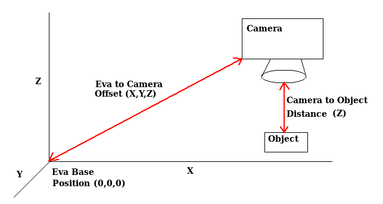

# sdk_example_vision

This example shows how you may interface a machine vision camera with the Eva Python SDK for dynamically moving Eva to a object detected by the camera.

## Requirements

This example assumes you have a working machine vison camera. The camera should be trainable to give the X and Y coordinates of a detected object relative to the camera frame. You should be able to input this X and Y position into the Python script.

The example also requires you to measure the x, y, z axis offset of the camera's position relative to Eva's base and the distance between the camera and the 2D plane where the objects will be detected. This example assumes that the camera's axis are aligned with Eva's.

